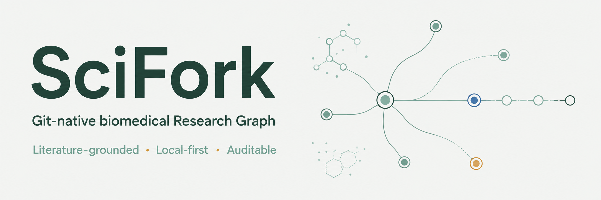

# SciFork

[](https://github.com/zhang-bin-98/sci-fork/actions/workflows/release.yml) [](LICENSE)



[English](README.md) | [简体中文](README.zh-CN.md)

> 拆分假设，连接证据，推进研究。

SciFork 是面向 [DeepSeek Harness (DSH)](https://github.com/deepseek-ai/deepseek-harness)
的本地、Git 原生生物医学研究图谱（Research Graph）插件。你仍然在 DSH Chat 中完成
所有对话界面，SciFork 则打开一个与 DSH 同源的图谱 Companion，帮助组织研究问题
（Research Question）、假设（Hypothesis）、证据（Evidence）、研究结果（Result）和
研究发现（Finding）。

研究项目（Research Project）始终是本地 Git 仓库中的普通 Markdown 和 JSON 文件。
图谱只是这些文件可重建的视图，不是另一个数据库；SciFork 不会上传项目，也不提供
云同步。

> **早期版本：** SciFork `0.0.1` 锁定 DSH `0.1.1-rc.2` 的公开接口。

## 你可以做什么

- 把一个开放式研究问题整理成相互连接、便于检查的研究图谱。
- 导入以 PMID 或 DOI 标识的文献证据，也可以使用随插件提供的 Skill 检索 PubMed。
- 将研究团队产生的结果、对结果的解释和未经验证的假设清楚地区分开。
- 在 **Main** 视图查看整个项目，或在 **Evidence** 视图聚焦某个实体的直接证据断言。
- 点击 **Research & Expand**，从当前焦点（Focus）执行一次文献驱动的扩展。每次点击只执行
  一步，最多产生五条直接相连的低置信分支。
- 每次成功修改研究内容后，尝试只为 SciFork 受管文件创建本地 Git 检查点。

## 安装

### 前置条件

- 使用 Web profile 的 DSH `0.1.1-rc.2`
- Node.js `^22.19.0 || >=24.0.0`
- pnpm `11.23.0`（建议通过 Corepack 使用）
- 已配置 `user.name` 和 `user.email` 的 Git
- 配置为本机回环访问（`127.0.0.1`）的 DSH Web

### 从 GitHub Releases 安装

1. 从 [GitHub Releases 页面](https://github.com/zhang-bin-98/sci-fork/releases)下载
   `dsh-scifork-0.0.1.tgz` 和 `dsh-scifork-0.0.1.tgz.sha256`。
2. 将两个文件放在同一目录，并校验安装包。

Linux：

```sh
sha256sum -c dsh-scifork-0.0.1.tgz.sha256
```

macOS：

```sh
shasum -a 256 -c dsh-scifork-0.0.1.tgz.sha256
```

Windows PowerShell：

```powershell
$archive = 'dsh-scifork-0.0.1.tgz'
$expected = (Get-Content "$archive.sha256").Split()[0].ToLowerInvariant()
$actual = (Get-FileHash $archive -Algorithm SHA256).Hash.ToLowerInvariant()
if ($actual -ne $expected) { throw 'SHA-256 verification failed' }
```

3. 将已校验的安装包添加到 DSH Web profile。

```sh
dsh plugin --profile web add ./dsh-scifork-0.0.1.tgz
```

4. 从你希望作为 Research Project 的目录启动 DSH。

```sh
dsh --profile web
```

如果安装时 DSH 已经在运行，请重启 DSH。以后如需卸载，执行：

```sh
dsh plugin --profile web remove dsh-scifork
```

## 第一次使用

请选择不位于其他 Git 仓库内的目录，或者使用本身就是 Git 仓库根目录的目录。在 DSH
Chat 中对当前目录执行一次初始化：

```text
/research init
```

SciFork 会创建项目文件；如果当前目录还不是 Git 仓库，则初始化一个本地仓库；然后记录
基线检查点。完成后，点击 DSH 侧栏中的 **Research Graph** 打开图谱 Companion。

一个典型的研究流程是：

1. 在 DSH Chat 中描述开放式生物医学问题。SciFork 会把它记录为研究问题，而不是直接
   当作已成立的主张。
2. 请 DSH 检索相关文献，再将有依据的断言导入项目。随插件提供的 PubMed Skill 支持
   PubMed 查询，也可以按 PMID 或 DOI 查找。
3. 打开 **Research Graph**，检查问题、证据、假设、结果、发现及其关系。
4. 选中一个实体，需要继续探索时点击 **Research & Expand**，执行一次有界扩展。
   只有在当前 DSH Chat 中明确请求 Progressive Research Run，才会开始多层探索。
5. 将机器审核证据（machine-reviewed Evidence）接受为人工审核证据前，请先人工核对。
   只有人工审核证据或已验证的研究结果才能支持研究发现。
6. 随时可以检查项目：

```text
/research validate
```

图谱 Companion 用于浏览和检查。研究、纠正内容或修改图谱仍然通过 DSH Chat 提出。

## 数据与安全

SciFork 设计为在 DSH 本地 loopback Web 服务中使用。文献、PDF、模型输出和项目
Markdown 都会被视为不可信数据，Companion 不会自动加载远程内容。检索结果可能保留在
当前 DSH Chat 中，但 SciFork 不会把完整摘要或 PDF 保存到 Research Project。

提交或分享 Research Project 前，请检查其中是否包含 PHI、PII 或受控访问数据。完整的
数据和网络边界请参阅 [SECURITY.md](SECURITY.md)。

## 许可证

SciFork 使用 [MIT License](LICENSE)。Research Project 数据可能有独立的所有权和分享条款。
